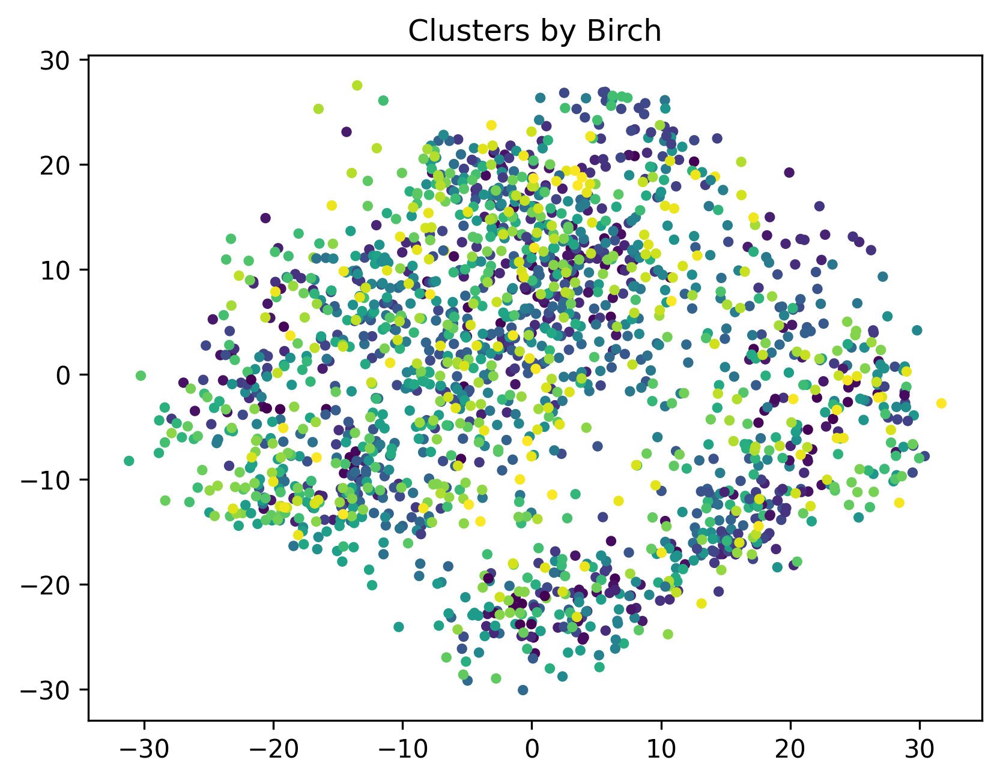
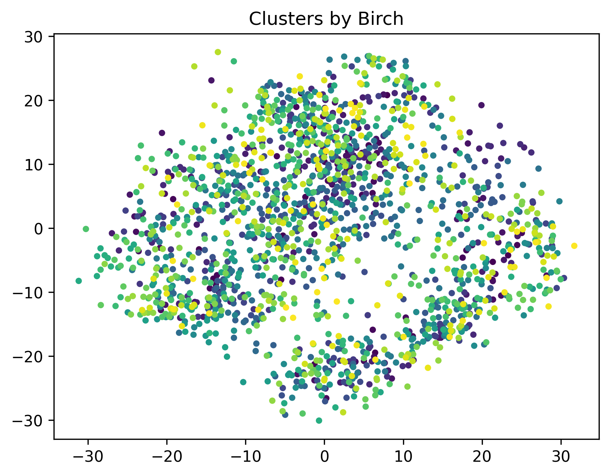
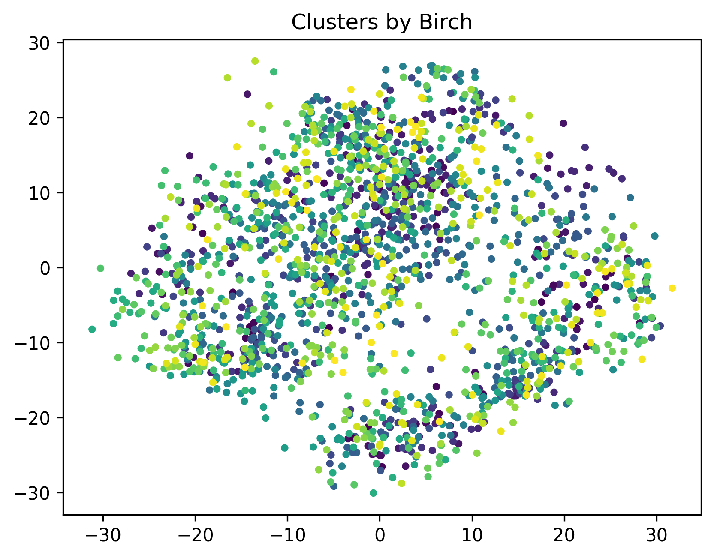

# Project Birch - Clustering Algorithm

This project implements the Birch clustering algorithm and tests it on the digits dataset from scikit-learn.

## Key Parameters
- `threshold`: Maximum radius of clusters.
- `branching_factor`: Maximum number of subclusters in each node of the clustering tree.

## Project Structure
- `birch.py`: Implementation of the Birch algorithm.
- `test_birch.py`: Unit tests for the Birch implementation.
- `Birch_analysis.ipynb`: Notebook for analyzing and visualizing clustering results.

## Results of the Birch Algorithm on the `digits` Dataset

- **Parameters:**
  - `threshold`: 15
  - `branching_factor`: 50
- **Metrics:**
  - Homogeneity Score: 1.0
  - Completeness Score: 0.32

### Visualization:

### Results for `threshold=10` and `branching_factor=30`
- **Metrics:**
  - Homogeneity Score: 1.00
  - Completeness Score: 0.30
- **Visualization:**
  

### Results for `threshold=12` and `branching_factor=40`
- **Metrics:**
  - Homogeneity Score: 1.00
  - Completeness Score: 0.31
- **Visualization:**
  

| Threshold | Branching Factor | Homogeneity Score | Completeness Score |
|-----------|------------------|-------------------|--------------------|
| 10        | 30               | 1.00              | 0.30               |
| 12        | 40               | 1.00              | 0.31               |
| 15        | 50               | 1.00              | 0.32               |